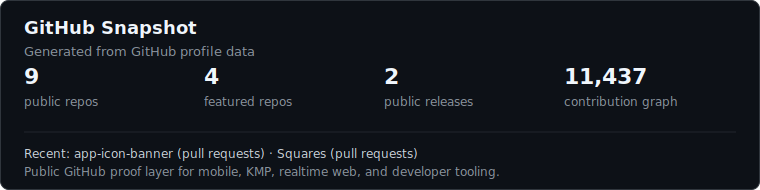
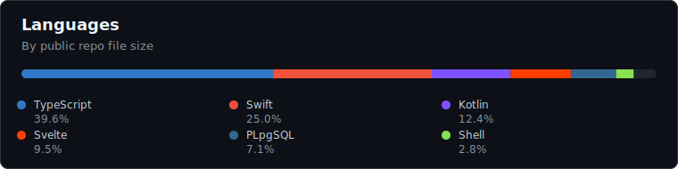
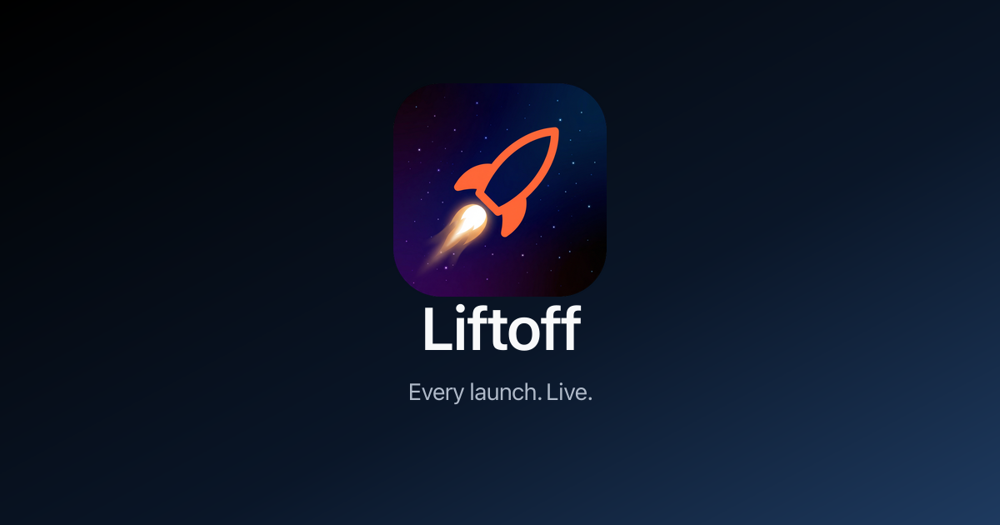
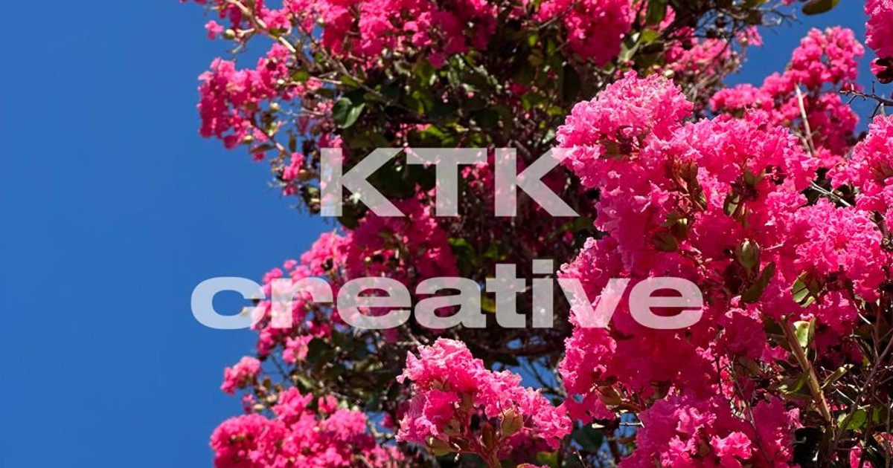

# Nathan Krebs

I build production mobile and web software, mostly where Android architecture, Kotlin Multiplatform, product polish, and developer tooling overlap.

Lead Android Engineer at Disney+. I use AI-driven development heavily in my day-to-day loop, but the bar is still the boring stuff that survives contact with production: clean diffs, useful tests, readable architecture, and releases that do not turn into archaeology.

Open to contract work and worthwhile engineering conversations through [LinkedIn](https://www.linkedin.com/in/nathan-krebs0/).

[nathankrebs.com](https://nathankrebs.com) · [LinkedIn](https://www.linkedin.com/in/nathan-krebs0/)

  

  

## In Production

<table>
  <tr>
    <td width="50%" valign="top">
      
       
      <strong><a href="https://get-liftoff.app">Liftoff</a></strong> 
      iOS / Android · App Store + Google Play
        
      Rocket launch tracking with a countdown-first feed, mission detail, launch alerts, supported SpaceX telemetry, and Android widgets.
    </td>
    <td width="50%" valign="top">
      
       
      <strong><a href="https://www.ktkcreative.com">KTK Creative</a></strong> 
      Web · photography / videography business
        
      Custom production site for my wife's photography business: portfolio, services, inquiry flow, and admin-managed content behind the scenes.
    </td>
  </tr>
</table>

## Open Source Apps

| Project | Platform | Surface | Notes |
| --- | --- | --- | --- |
| [Squares](https://github.com/nkrebs13/Squares) | Web / PWA | [Live demo](https://squares.nathankrebs.com) · [Repo](https://github.com/nkrebs13/Squares) | Full-stack realtime multiplayer web app. SvelteKit 5, Supabase Realtime, Cloudflare Pages, CI, ADRs, and a production run with real users. |
| [PomoDaddy](https://github.com/nkrebs13/PomoDaddy) | macOS | [Releases](https://github.com/nkrebs13/PomoDaddy/releases) · [Homebrew cask](https://github.com/nkrebs13/homebrew-tap) | Menu-bar Pomodoro timer built with SwiftUI and SwiftData. Local-first, Homebrew-installable, and named exactly as seriously as it needs to be. |

## Open Source Tools

| Project | Platform | Surface | Notes |
| --- | --- | --- | --- |
| [kmp-template](https://github.com/nkrebs13/kmp-template) | Kotlin Multiplatform | Template repo | Production-oriented iOS/Android starter with Compose Multiplatform, code quality gates, and AI-assisted project generation. |
| [app-icon-banner](https://github.com/nkrebs13/app-icon-banner) | Gradle / KMP | [Gradle Plugin Portal](https://plugins.gradle.org/plugin/io.github.nkrebs13.app-icon-banner) · [Repo](https://github.com/nkrebs13/app-icon-banner) | Gradle plugin that stamps Android and iOS app icons from one DSL. Small tool, real developer-experience problem. |

## Currently

| Track | Shape |
| --- | --- |
| Android / KMP | Lead Android at Disney+; building mobile systems where product UX and architecture both matter. |
| Realtime web | Squares is the public example: SvelteKit, Supabase Realtime, PWA, production runbook. |
| Developer tooling | KMP templates, Gradle plugins, release-loop cleanup, and anything that removes repeat work. |
| AI-driven development | Heavy daily use for implementation, review, automation, and verification. The output still has to be maintainable code. |

## Recent Public Activity

<!-- github-pulse:start -->
- Recent public activity: [app-icon-banner](https://github.com/nkrebs13/app-icon-banner) (pushes, pull requests); [Squares](https://github.com/nkrebs13/Squares) (pull requests).
- Latest public releases: [Squares v1.0.0 — Super Bowl Sunday 2026](https://github.com/nkrebs13/Squares/releases/tag/v1.0.0); [PomoDaddy v2026.3.5](https://github.com/nkrebs13/PomoDaddy/releases/tag/v2026.3.5).
- Featured public repos: [Squares](https://github.com/nkrebs13/Squares) (TypeScript, MIT); [kmp-template](https://github.com/nkrebs13/kmp-template) (Shell, MIT); [app-icon-banner](https://github.com/nkrebs13/app-icon-banner) (Kotlin, MIT); [PomoDaddy](https://github.com/nkrebs13/PomoDaddy) (Swift, MIT).
<!-- github-pulse:end -->

  

